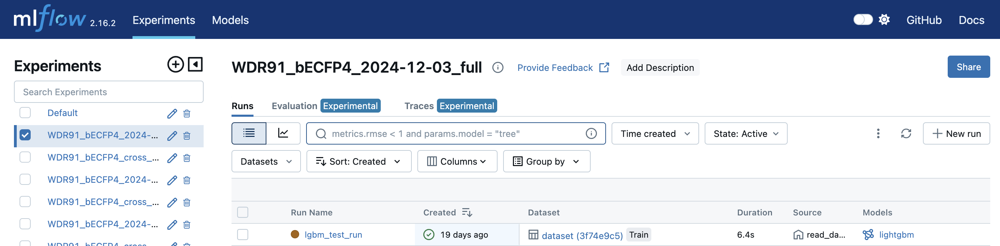
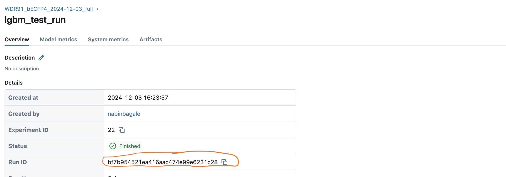
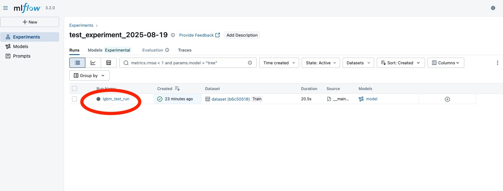
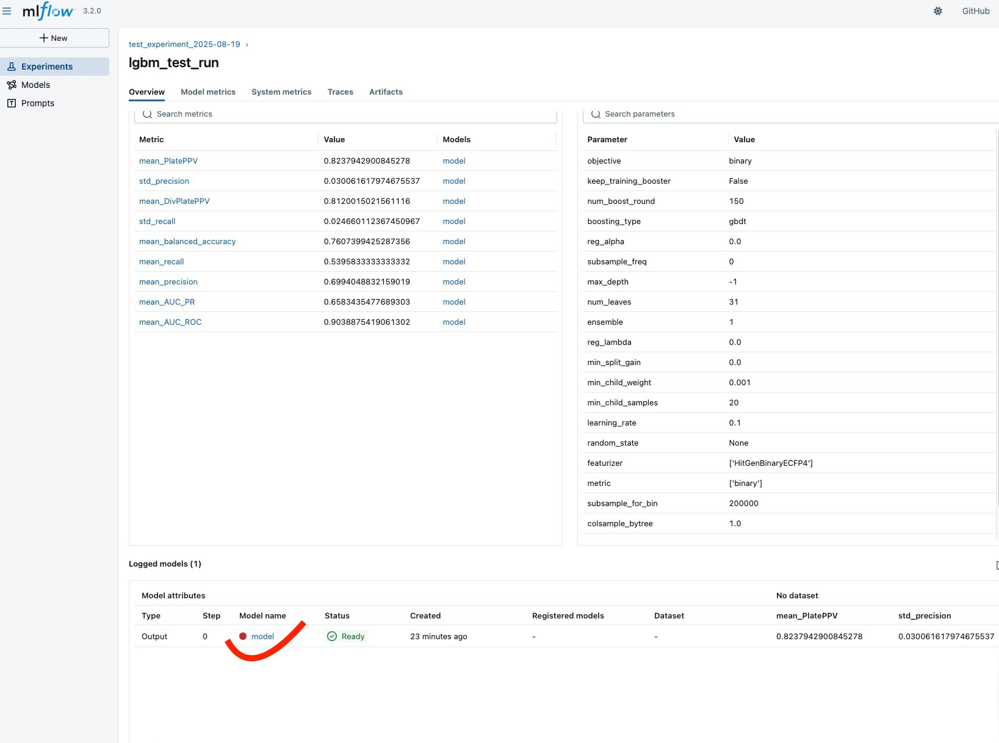
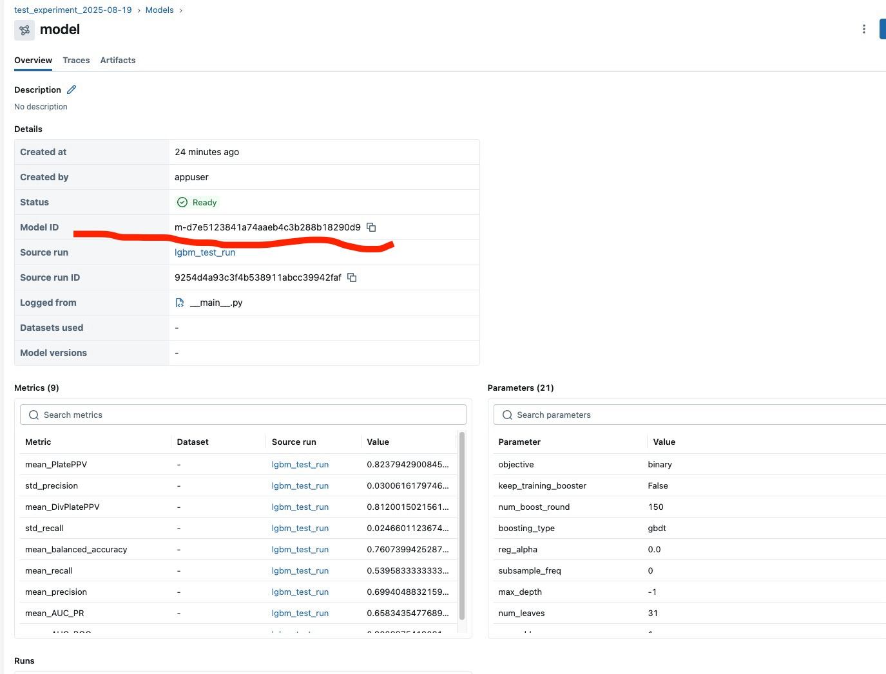

# DEL-ML: Machine Learning Pipeline for DEL Compound Screening


## Overview


DEL-ML is a portable, containerized machine learning pipeline designed for DNA-Encoded Library (DEL) compound screening. The system provides end-to-end capabilities for training models, screening compounds, and serving predictions through a REST API.

## Project Description

This project uses **MLflow** (local/hosted), **Docker**, and **Google Cloud Platform (GCP)**.  
It supports multiple runtime environments, depending on your setup:

| Option | MLflow Setup        | Docker Location   | Data Storage / Model Storage | Notes |
|--------|---------------------|------------------|------------------------------|-------|
| 1      | Local MLflow        | Local machine    | Local filesystem             | Fully local run |
| 2      | Hosted MLflow       | Local machine    | Local filesystem             | Remote tracking with local compute |
| 3      | Local MLflow        | Local machine    | GCP GCS bucket (read/write)  | Data and models stored in GCS |
| 4      | Hosted MLflow (GCP) | GCP (Vertex AI)  | GCP GCS bucket               | Full GCP environment |


# Technology Stack


## Core Technologies


-  **Python 3.11+** - Primary programming language


-  **Docker & Docker Compose** - Containerization and orchestration


-  **FastAPI** - REST API framework for model serving


-  **MLflow** - Experiment tracking and model management


## Machine Learning & Data Processing


-  **Pandas & PyArrow** - Data manipulation and parquet file processing


-  **Scikit-learn** - Machine learning algorithms and preprocessing


-  **lightgbm** - Machine learning algorithms


-  **NumPy** - Numerical computing


-  **RDKit** - Chemical informatics and molecular fingerprints


## Cloud & Infrastructure (Optional)


-  **Google Cloud Platform (GCP)** - Cloud deployment platform


-  **Vertex AI** - Managed ML training and deployment


-  **Google Cloud Storage** - Data and model artifact storage


-  **Container Registry** - Docker image management


## Development & Deployment


-  **Make** - Build automation and task management


-  **Bash scripting** - Container orchestration and environment setup


-  **YAML** - Configuration management


### Key Features


- 🐳 **Fully Containerized**: Docker-based architecture for consistent deployment across environments


- 🔧 **Portable & Flexible**: Run locally, on-premises, or in cloud environments

-

- 📊 **MLflow Integration**: Support for both local and hosted MLflow servers for experiment tracking


- ☁️ **Multi-Cloud Ready**: Native GCP integration with extensible architecture for other cloud providers (This version is built for GCP but can be easily adapted for deployment on other cloud platforms such as AWS or Azure)


- 🚀 **Production Ready**: FastAPI-based REST API for real-time and batch predictions


- 📈 **Scalable**: Support for large-scale screening with memory-optimized data processing


## Architecture


The system consists of three main modules:


1.  **Train Module**: Model training with automated experiment tracking


2.  **Screen Module**: High-throughput compound screening


3.  **API Module**: REST API for individual and batch predictions


## Prerequisites


### Core Requirements


- Docker & Docker Compose


- Python 3.10+


- 4GB+ RAM (recommended for large datasets)


### Optional (for GCP deployment)


- Google Cloud SDK

- GCP Service Account with appropriate permissions

- Vertex AI and Container Registry access


## Configuration


### Environment Variables (.env)

  
The system uses different `.env` files depending on deployment:

-  **Local deployment**: `deployment/local/.env`


-  **GCP deployment**: `.env` (root directory)


#### Key Configuration Options


```bash

# MLflow Configuration

MLFLOW_TRACKING_URI=http://localhost:5001  # Local server

# MLFLOW_TRACKING_URI=https://your-hosted-mlflow.com # Hosted server

USE_EXTERNAL_MLFLOW=false  # Set to true for hosted MLflow

# GCP Configuration (for cloud deployment)

GOOGLE_CLOUD_PROJECT=your-project-id

GCP_REGION=us-central1

ARTIFACT_REGISTRY_URI=gcr.io/your-project/del-ml

# Model Configuration

MODEL_SAVE_DIRECTORY=/app/models

API_PORT=8000

MLFLOW_PORT=5001

```

### ML Configuration (ml_config.yaml)


Located in `config/ml_config.yaml`:

```yaml


ml_config:


# Data Configuration


input_data_path:  "data/raw/WDR91_subset"  # Local path (Download the file from [AIRCHECK Website](https://www.aircheck.ai/datasets) and place it in the `data/raw/` directory)

# input_data_path: "gs://your-bucket/data/WDR91_subset" # GCP path

# Model Configuration

columns_of_interest: #name of column you want use for model training

-  ECFP4 #(Example)

target_col:  LABEL #Target column name

is_binarized_data:  true #Set to `true` to convert the data column into binary format; otherwise, set it to `false`.


# Training Configuration

model_name:  WDR91_ECFP4_model #name of model you want create

cluster_generation:  true ##Set to `true` to convert the data column into cluster; otherwise, set it to `false`.

isdry_run:  false #(if true it only takes 10K records from provided dataset)

# Output Configuration

model_save_directory:  "/app/models"

result_output:  "results/screening_results.smi"

# result_output: "gs://your-bucket/results/screening_results.smi" # GCP path

# Screening Configuration

smile_location:  "data/screening/compounds.smi" #Path to the SMILES files. Update this if your files are stored in a different location.

# smile_location: "gs://enamine-vs/dataset/" # GCP path

```

## Deployment Options

  If you want to run locally using the GCP-hosted MLflow server, uncomment the first line and comment out the second line in `train.py` file:


```bash

# Use this for local run with GCP-hosted MLflow

service_account_path="../service_account.json"


# Comment this out

# service_account_path="../app/service_account.json"


```

### Option 1: Local Machine with Local MLflow


**Best for**: Development, testing, small datasets


```bash


cd  deployment/local


# 1. Configure local environment


cp  .env.example  .env


# Edit .env as needed


# 2. Prepare your data


# Place your training data in deployment/local/data/raw/


# 3. Start the pipeline

make  up-local


# 4. Monitor training


# Access MLflow UI at http://localhost:5001


# 5. Clean up when done


make  prune


```


### Option 2: Local Machine with Hosted MLflow


**Best for**: Team collaboration, experiment sharing


```bash


cd  deployment/local


# 1. Configure for hosted MLflow

cp  .env.example  .env

# Set MLFLOW_TRACKING_URI to your hosted server


# Set USE_EXTERNAL_MLFLOW=true


# 2. Add service account (if using GCP MLflow)


# Copy your service_account.json to deployment/local/


# 3. Start training


make  up-local


```


### Option 3: GCP Vertex AI Deployment


**Best for**: Production, large-scale training, team environments


#### Prerequisites


- GCP Project with Vertex AI and Container Registry enabled


- Service account with required permissions:


- Vertex AI User

- Storage Admin


- Container Registry Admin


#### Deployment Steps


```bash

# 1. Configure GCP environment


cp  .env.example  .env


# Configure GCP-specific settings


# 2. Authenticate with GCP


gcloud  auth  login


gcloud  config  set  project  YOUR_PROJECT_ID


# 3. Build and push Docker image ()


make  build


make  push

```
#### Step‑by‑Step (Console)

1.  **Open Vertex AI → Training pipelines**  
    Console → _Vertex AI_ → _Training_ → _Training pipelines_ → **Create**.
    
2.  **Training method**
    
    -   **Dataset:**  _No managed dataset_
        
    -   **Method:**  _Custom training (advanced)_  
        Click **Continue**.
        
3.  **Model details**
    
    -   Choose **Train new model** (or _Train new version_).
        
    -   Enter a **Model name** → **Continue**.
        
4.  **Training container**
    
    -   **Container type:**  _Custom container_.
        
    -   **Container image:** paste your image URI from Artifact Registry, e.g.  
        `us-central1-docker.pkg.dev/PROJECT/REPO/IMAGE:TAG`.
        
    -   **Model output directory:**  `gs://YOUR_BUCKET/path/`  
        _(Vertex AI will set env vars like_ `_AIP_MODEL_DIR_`_,_ `_AIP_CHECKPOINT_DIR_`_,_ `_AIP_TENSORBOARD_LOG_DIR_` _for you.)_
        
    -   **Arguments (optional):** any CLI args your container expects, e.g.  
        `--train-data=gs://YOUR_BUCKET/data/train.parquet --epochs=10 --lr=0.001`  
        _(For_ **_custom containers_**_, these args override the image’s default_ **_CMD_**_.)_  
        Click **Continue**.
        
5.  **Hyperparameter tuning**
    
    -   Leave **Enable hyperparameter tuning** unchecked (for a simple run).  
        Click **Continue**.
        
6.  **Compute & pricing**
    
    -   **Region:** pick a Vertex AI training region (e.g., `us-central1`).
        
    -   **Worker pool 0:** choose **Machine type**, **Accelerators** (if needed), **Replica count** (usually 1).
        
    -   **Service account:**
        
        -   Default is the _Vertex AI Custom Code Service Agent_ or the _Compute Engine default service account_ (varies by project).
            
        -   Ensure this account can **pull the image** (Artifact Registry _Reader_) and **write to GCS** (Storage roles).  
            Click **Continue**.
            
7.  **Prediction container**
    
    -   Select **No prediction container** (you can upload/serve later).
        
8.  **Start**
    
    -   Click **Start training**.


## API Usage


### Starting the API Server

Make  sure  that  your  mlflow  server  is  up  and  running

```bash


cd API

```

cp  .env.example  .env

```bash

make api-run

# you can also perform following:

# Start the API server

docker build -t  <image name> .

docker run -d  -p 8000:8000 <image name>

# Access API documentation


# Navigate to http://localhost:8000/docs


```


### API Endpoints

You can perform **compound prediction** and view **model statistics** in two ways:

1.  **API Documentation (recommended)**  
    Open your browser and go to:  
    [http://localhost:8000/docs](http://localhost:8000/docs)  
    This provides an interactive Swagger UI where you can try out the endpoints directly.
    
2.  **Using cURL**  
    You can also send requests from the command line, for example:

#### 1. Compound Prediction


```bash

curl -X 'POST' \
  'http://localhost:8000/process-input/?model_id=<MODEL_ID>&mlflow_url=<MLFLOW URL>' \
  -H 'accept: application/json' \
  -H 'Content-Type: multipart/form-data' \
  -F 'text_input=<COMPOUND>'


```


#### 2. Get ML metrics


```bash

curl -X 'POST' \
  'http://localhost:8000/get-metrics/?mlflow_server_url=<MLFLOW server>run_id=<RUN-ID>' \
  -H 'accept: application/json' \
  -d ''

```

### Notes

-   For **mlflow_server_url**, use:
    
    `http://host.docker.internal:5001` 
    
-   The values for **`model_id`** and **`run_id`** can be obtained from your MLflow tracking server.
    
    -   `model_id` → available from the registered models section.
        
    -   `run_id` → available from the experiment runs.


### Getting MLflow Run ID


1. Access your MLflow server (local: http://localhost:5001)


2. Navigate to **Experiments** tab


3. Click on your experiment name


4. Select the desired model run


5. Copy the **Run ID** from the run details



### Getting MLflow Model ID


1. Access your MLflow server (local: http://localhost:5001)


2. Navigate to **Experiments** tab


3. Click on your Run name


4. Scroll down a bit in Logged models section

5. Click on Model name


5. Copy the **Model ID** from the model details



## Accessing Screened Results


After the screening process completes, you'll need to retrieve the results. The method depends on your deployment type.


### Local Deployment

Since the screening runs inside a Docker container, the results are initially stored within the container filesystem. Here's how to access them:

You can run predictions in two ways:

1.  **Using Makefile**:
    
    `make run_prediction` 
    
    This will save the filtered SMILES along with their prediction values in the `data/processed` folder.
    
2.  **Using Docker**:  
    Access the container and run the following command:
  


#### Copy Files from Container to Local Directory


```bash


# 1. Find your container ID or name


docker  ps

# or

docker  ps  -a  # if container has stopped

# 2. Copy screened results to local directory

docker  cp  <container_id>:/app/data/processed/sample_enamin_subset.smi  ./local_results/

# Example: docker cp del-ml-training:/app/results/screening_results.smi ./results/

# 3. Copy model files if needed

docker  cp  <container_id>:/app/models/  ./local_models/

```


#### Option 2: Access Files Inside Running Container


```bash

# 1. Enter the running container

docker  exec  -it  <container_name>  /bin/bash

# Example: docker exec -it del-ml-training /bin/bash

# 2. Navigate to results directory


cd  /app/data/processed

# 3. List available files

ls  -la

# 4. View file contents

head  sample_enamin_subset.smi

cat  sample_enamin_subset.smi


# 5. Exit container


exit


```


## Data Formats


### Training Data Format

```csv


SMILES,ECFP4,LABEL

CCO,bit_vector_int,1

CCN,bit_vector_int,0

CCC,bit_vector_int,1


```


### Screening Data Format

```smi

1,CN(CCCNc1ccccc1[N+](=O)[O-])C(=O)OC(C)(C)C,Z644685424
2,Clc1ccc(CNC2CCN(Cc3ccccc3)CC2)cc1Br,Z1599246016
3,COC(=O)c1cncnc1NCCCN(C)Cc1ccccc1,Z2088710703

```


## Makefile Commands


### Local Development


```bash


make  up-local  # Start local training

make  rebuild  # Rebuild Docker image

make  prune  # Clean up all resources

make  logs  # View container logs


```


### GCP Deployment


```bash


make  build  # Build Docker image

make  push  # Push to GCP Container Registry

```


## Troubleshooting


### Common Issues

#### Memory Errors


```bash

# Increase Docker memory allocation


docker  run  --memory=4g  --memory-swap=4g  your-image


```


#### MLflow Connection Issues


```bash


# Check MLflow server status


curl  http://localhost:5001/api/2.0/mlflow/experiments/list


# Verify environment variables


echo $MLFLOW_TRACKING_URI


```


### Performance Optimization

#### For Large Datasets

- Use GCP deployment with high-memory instances


- Enable data streaming for very large files


- Consider data preprocessing and filtering


## Monitoring and Logging


### MLflow Tracking


-  **Local**: http://localhost:5001


-  **Hosted**: Your hosted MLflow server URL


### Container Logs


```bash


# View real-time logs

docker-compose  logs  -f


# Export logs


docker-compose  logs  >  training_logs.txt


```


### GCP Monitoring

- Use GCP Cloud Logging for Vertex AI jobs


- Monitor resource usage in GCP Console


- Set up alerts for job failures


## License


## Support


For issues and questions:

- Check the troubleshooting section above

- Review logs for error messages


- Submit issues via GitHub Issues